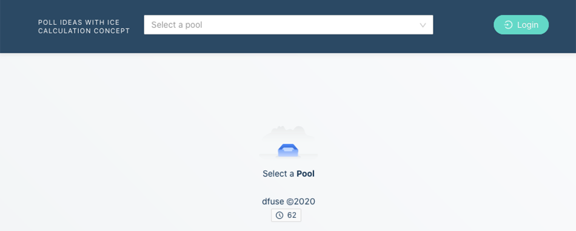

# ICE Pools (powered by [dfuse for EOSIO](https://github.com/dfuse-io/dfuse-eosio))

## Table of Content

- [Running ICE Pools](#running-ice-pools)
  - [Requirements](#requirements)
  - [1. Cloning the ICE repo](#cloning-the-ice-repo)
  - [2. Compiling the ICE Smart Contract](#compiling-the-ice-smart-contract)
  - [3. Installing _dfuse for EOSIO_](#installing-dfuse-for-eosio)
  - [4. Bootstrapping our Local Blockchain](#bootstrapping-our-local-blockchain)
  - [5. Testing our Smart Contract](#testing-our-smart-contract)
  - [6. Starting the ICE Pools App](#starting-the-ice-pools-app)
  - [7. Browsing the ICE Pools app](#browsing-the-ice-pools-app)
  - [8. Installing the Anchor Wallet](#installing-the-anchor-wallet)
  - [9. Adding our Custom Blockchain to the Wallet](#adding-our-custom-blockchain-to-the-wallet)
  - [10. Importing Key Pairs in the Wallet](#importing-key-pairs-in-the-wallet)
  - [11. Importing Accounts in the Wallet](#importing-accounts-in-the-wallet)
  - [12. Logging in the ICE Pools app](#logging-in-the-ice-pools-app)
  - [13. Adding a Pool](#adding-a-pool)
  - [14. Adding an Idea](#adding-an-idea)
  - [15. Casting Votes](#casting-votes)
  - [16. Exploring Pools, Ideas and Votes on the Blockchain](#exploring-pools-ideas-and-votes-on-the-blockchain)
- [Understanding How It Works](#understanding-how-it-works)
  - [Frontend Authentication](#frontend-authentication)
  - [Streaming Transaction Data with dfuse](#streaming-transaction-data-with-dfuse)
  - [Reading Contract State Tables with dfuse](#reading-contract-state-tables-with-dfuse)
  - [Calling Smart Contract Actions with UAL and Wallets](#calling-smart-contract-actions-with-ual-and-wallets)
  - [Understanding the ICE Smart Contract](#understanding-the-ice-smart-contract)

## Running ICE Pools

This tutorial is a step by step guide on how to get ICE Pools up and running in your browser where we take our time to go over each step and explain what some of the code does. We're also going to show you how to interact with the app once it's up and running.

If you're an experienced developer and you're looking for a faster way to get up and running with ICE Pools, take a look at the [Running ICE Pools](https://github.com/dfuse-io/ice/blob/master/README.md#running-ice-pools) section in the [README](https://github.com/dfuse-io/ice/blob/master/README.md).

### Requirements

This tutorial assumes that you have basic programming knowledge and that you have these tools already installed in your dev environment (or follow the `installation` links to install them).

* `EOSIO.CDT` v1.7.0 or higher ([installation](https://github.com/EOSIO/eosio.cdt#binary-releases))
* `Git` ([installation](https://git-scm.com/book/en/v2/Getting-Started-Installing-Git))
* `Go` v1.14 or higher ([installation](https://golang.org/doc/install#install))
* `NodeJS` v14.0.1 or higher ([installation](https://nodejs.org/en/download/package-manager/))
* `yarn` v1.15 or higher ([installation](https://classic.yarnpkg.com/en/docs/install))
* (_For macOS_) Command Line Tools for Xcode ([installation](https://developer.apple.com/downloads/))

_**NOTE** - The Windows OS is not currently supported by `dfuse for EOSIO`, which is required by ICE Pools._


### 1. Cloning the ICE Repo

The first step we need to take is obviously to clone this repo! Open a terminal window and `git clone` the repo:

```
# clone the ICE Pools repo
git clone https://github.com/dfuse-io/ice
```

### 2. Compiling the ICE Smart Contract

Once we have the repo cloned to our dev environment, the first thing we want to do is to compile our smart contract in order to deploy it to our local testnet. We've provided a couple bash scripts to make this demo easier. You can find them all int the `/contract` folder. To compile our smart contract, we simply need to move inside the `contract` folder and run the `compile.sh` file:

```
# move inside the contract folder and run compile.sh
cd ice/contract
./compile.sh
```

The `compile.sh` script uses the `EOSIO.CDT` CLI tool (installed in [Requirements](#requirements)) to compile our `ice.cpp` contract into `ice.wasm` and `ice.abi`. It is a very simple script that creates a `build` folder inside the `bootstrapping` folder and stores the two compiled files (`ice.wasm` and `ice.abi`) in it. If you're looking to understand what's inside the smart contract and what it actually accomplishes, take a look at [Understanding the ICE Smart Contract](#understanding-the-ice-smart-contract) at the bottom of this tutorial.

Now that our smart contract is compiled, we're ready to install [_dfuse for EOSIO_](https://github.com/dfuse-io/dfuse-eosio) which will allow us to run an [EOSIO](https://eos.io/) testnet locally.

### 3. Installing _dfuse for EOSIO_

[dfuse](https://www.dfuse.io) is a massively scalable open-source platform for searching and processing blockchain data. dfuse for EOSIO includes all [dfuse services](https://dfuse.io/technology) for EOSIO as a single statically linked binary: `dfuseeos`. You can easily run `dfuseeos` locally or from a container.

The easiest way to get the `dfuseeos` binary is to download the latest stable version in a tarball (files that have been packed into a tar file like `*.tar.gz`) from the [Releases](https://github.com/dfuse-io/dfuse-eosio/releases/) page under the `Assets` section (after each release notes, you will find the `Assets` section).

Once you have downloaded the right file for your OS, extract its content and move the `dfuseeos` binary inside your `$GOPATH/bin` folder*.
  
If you'd rather install _dfuse for EOSIO_ from source, take a look at the `dfuse-eosio` [install from source](https://github.com/dfuse-io/dfuse-eosio#from-source) guide but be advised it's a longer process. If you do decide to install from source, you do not need to create or initialize a chain with _dfuse for EOSIO_ at this time. More about that later.

_*Your `$GOPATH` is where Go is installed on your system. By default, on macOS, your `$GOPATH` is `/Users/$USER/go` where `$USER` is your username. If you installed `Go` through [`Homebrew`](https://brew.sh/), your folder structure will be different._

### 4. Bootstrapping Our Local Blockchain

In order to run an EOSIO testnet, we must first bootstrap our local blockchain with system accounts. We also need to create a few accounts, delegate bandwidth, and fund accounts with tokens for our development needs. This is an important step to enable accounts to push feeless transactions.
 
Your terminal window should already be in the `contract` folder because of [step #2](#compiling-the-ice-smart-contract), so all we need to do is run the `boot.sh` script that will automate all of the account creation and funding process. `boot.sh` will also initialze _dfuse for EOSIO_ for us, purge it (clean start), and then start it.

```
# run boot.sh
./boot.sh
```

_**For macOS** - If you get a prompt similar to `Do you want the application “dfuseeos” to accept incoming network connections?`, you should select `allow` as `dfuseeos` needs to accept connections from your local environment._

`boot.sh` reads from the config file at `contract/bootstrapping/bootseq.yaml` to execute operations on our testnet. In the `bootseq.yaml` file, we define the operations to perform on our chain. In this case, we create the system accounts for EOSIO contracts and deploy them. We also create 4 accounts: one account named `dfuse.ice` which is where we will deploy our smart contract, and three accounts named `msdelisle`, `mrkauffman`, and `theboss` with tokens for us to use. These accounts are also delegated [CPU](https://developers.eos.io/welcome/latest/overview/core_concepts/#cpu), [NET](https://developers.eos.io/welcome/latest/overview/core_concepts/#network-net), and [RAM](https://developers.eos.io/welcome/latest/overview/core_concepts/#ram). The script also handles deploying the compiled ICE smart contract to the `dfuse.ice` account.

A successful `dfuseeos` start by `boot.sh` will list the _dfuse for EOSIO_ applications that were launched with their relevant links. We don't need those for now, but it's nice to know they will be there when we need them.

```
Dashboard:        http://localhost:8081

Explorer & APIs:  http://localhost:8080
GraphiQL:         http://localhost:8080/graphiql
```

Congrats! You now have a fully bootstrapped EOSIO chain running locally with a `dfuse.ice` account, a smart contract deployed, as well as three user accounts created and ready to use.

**Please note that you need to leave this process running in the terminal throughout this tutorial**

### 5. Testing Our Smart Contract

Let's test our smart contract by creating some pools to contain ideas, add ideas to pools and cast random user votes on these new ideas.

In a **new** (that's important) terminal window, run `test.sh` from the `contract` folder:

```
./test.sh
```

`test.sh` created 2 pools using the `dfuse.ice` account. We have the `new.feature` pool and the `hackathon` pool. Inside each pool, we've had users add ideas for new features they believe should be next on the roadmap, and hackathon ideas that they'd like to work on. Once those were added, we've had users (remember `msdelisle`, `mrkauffman`, and `theboss`?) vote random values on different ideas for the purpose of this tutorial.  Now we'll want to see these pools in action, the ideas, and the votes in an app with an actual user interface. That's in the next step.

_**NOTE** - If you get an error similar to `ERROR: pushing transaction: http://localhost:8080/v1/chain/push_transaction: status code=502`, that means that the chain was not yet ready to receive your transactions. Try to run the script again after a couple seconds._

[::TODO::] maybe in the ice tutorial, adding the step that I told you (ex: search for action:setcode or action:createaccount etc. in eosq webpage) so the user gets used to looking at the explorer, opening the contract page, looking at all this with a tab open on your contract page (with latest transactions), you would have seen right away what was wrong (404 account not found or whatever)
         
### 6. Starting the ICE Pools App

We're going to move out of the `contract` folder and go to the `web` folder. This is where the React frontend application lives. We have built a simple UI to interact with the smart contract and display data from it. We'll then install the necessary dependencies for the application, compile it, and serve it from your terminal with `yarn`.

```
# move to the web folder, install dependencies & start the app
cd ../web
yarn install && yarn start
```

Please bear with the yarn process as it might take some time to serve the app. You should automatically get a new tab opened in your browser that's pointing to `localhost:3000`. It will automatically serve the app once you see `Compiled successfully! You can now view web in the browser.` in your terminal window.

 If you didn't get a new tab, open a new one manually and go to [localhost:3000](http://localhost:3000/) to see the app in action. It should look similar to this:
 
 

_**NOTE** - If you receive a warning asking you if you want the application “node” to accept incoming network connections, answer `yes`._

**Please also note that you need to leave this process running in the terminal throughout this tutorial.**

### 7. Browsing the ICE Pools App

Because you're not logged in yet, we can only see the pools and the ideas that have been casted so far. The app shows all the available pools in a dropdown list at the top. Click on `Select a pool` and select the `hackathon` pool.


 
You should see 4 pre-populated ideas in the `hackathon` pool. You can click on any idea title to expand it and see the votes that were casted with their scores.


It's all fun and games to be able to "view" them, but what about being able to create new pools, add new ideas and possibly edit previous votes as a valid user. To do so, we need to be logged in to have the right permissions. The authorization process will be done through the usage of a wallet called Anchor.

### 8. Installing the Anchor Wallet

The [Anchor Wallet](https://greymass.com/en/anchor/) is an EOSIO Wallet and Authenticator released by the [Greymass](https://greymass.com/en) team. Installing the Anchor Wallet will allow us to validate our identity as a valid user. You can grab the latest stable version of the Anchor Wallet for your OS from https://greymass.com/en/anchor/ and install it. Once that is done, it's time to setup the wallet with our local bootstrapped blockchain.

### 9. Adding Our Custom Blockchain to the Wallet

This step assumes that this is a brand new Anchor Wallet installation. Once you have the wallet installed, follow these simple steps to add our local blockchain to the wallet interface:

1. Open the Anchor Wallet app
2. Select `Setup New Wallet` on the welcome screen
3. Select `Custom Blockchain` on the next screen


4. Then, enter the following information:
```
Chain ID:                           df383d1cc33cbb9665538c604daac13706978566e17e5fd5f897eff68b88e1e4
Name of Blockchain:                 ICE
Default node for this Blockchain:   http://localhost:8080
```

5. Skip the `Advanced Configuration` section
6. Check the box `This blockchain is a test network (TESTNET).`
7. Select `Save`


The network name we used (`ICE`) can be changed later. The blockchain host and the port are specified by `dfuseeos` and displayed at launched. The `Chain ID` is derived from the genesis state, and is also specified by `dfuseeos`. You can verify that it is indeed correct by running `eosc get info` in a **new** terminal window.

```
eosc get info
```

[`eosc`](https://eosc.app/) is a flexible & powerful command line tool to interact with an EOSIO chain. Running `get info` will display the current chain info. What we're looking for in this case is to confirm the `chain_id`.

 The last step we need to do is to "enable" our blockchain inside the Anchor app. You should be back to the `Which blockchains do you plan on using?` screen after saving your network infos:

* Scroll down the list of networks and look for the `testnet` labels.
* Scroll down further to find our `ICE` blockchain.
* Once you find it, select the checkbox next to it.


* Now, go back up and select `Enable 1 blockchains`.


The ICE network is now enabled within Anchor.

### 10. Importing Key Pairs in the Wallet

Now that we've added our new chain to the wallet, we'll want to use it to import keys and accounts inside the wallet.Next, follow these next steps to import our key pairs to the wallet:

1. Select `Tools` from the left-side menu
2. Under the `Security` table, select `Manage Keys`
3. Select `Import Key`
4. Set a password for you wallet and select `Set Password`
5. Re-enter the same password to confirm
6. Paste in the development private key (also specified by `dfuseeos`)
```
5KQwrPbwdL6PhXujxW37FSSQZ1JiwsST4cqQzDeyXtP79zkvFD3
```
_This key was used to boot the chain and generate all accounts. You can find this key again and its corresponding public key inside the `contract/bootstrapping` folder._
7. Select `Save Keys to Wallet`
8. Enter your wallet password (the one you just created on step 4.)
9. Select `Authorize`

And voilà! Your key is now saved inside the wallet. Time to look for accounts on your chain and add them to the wallet.

### 11. Importing Accounts in the Wallet

1. Select `Home` from the left-side menu
2. Select the blockchain card named `ICE`
3. Select `Scan for Accounts`
_This will automatically detect the available accounts for you key on the `ICE` network._
4. Select the three _active_ user accounts (`mrkauffman@active`, `msdelisle@active`, `theboss@active`)
5. Select `Import Accounts` at the bottom of the window
6. Enter your wallet password (the one you created on step 4. of `Importing Key Pairs in the Wallet`)
7. Select `Authorize`
8. Select `Yes, enable app integrations`

You should now see the three user accounts in the wallet, with their tokens and resources. Using these accounts, we'll use the wallet to authorize our login in the ICE Pools app.

### 12. Logging in the ICE Pools App

To interact with our smart contract from the user interface, we need to log into the app with a valid user account. The good news is, it's a really easy process:

1. Back in your browser window pointing to `localhost:3000`, click on the `Login` button
2. Select `Anchor`

3. Select `Open Anchor app` - _this should open a "Signing Request" window from Anchor_
4. Select one of the 3 user accounts from the dropdown list (we'll use "theboss" for this demo)
5. Select `Unlock Wallet + Sign` in the bottom right
6. Enter your wallet password
7. Select `Authorize`

Congratulations! You are now signed in as "theboss".

_**NOTE** - If you can't login or if your console is throwing an error similar to `WebSocket connection to 'wss://cb.anchor.link/064236d4-9bcc-4a93-89ff-c65acabda3e5' failed: Unknown reason` when you're trying to login through Anchor, one of your browser extensions is most likely blocking the connection. Try to disable them (Incognito sometimes doesn't work as intended) or try in a different browser._

### 13. Adding a Pool

_To add a pool, the app will be calling the `addpool` method on the `dfuse.ice` contract._

You can now add new pools and ideas, or even edit a past vote that your user made on an idea.

From the pool dropdown list, click on `Create a new pool!`, enter a pool name* in the dropdown that became an input, and click `Create Pool`. You have to go through a similar "Signing Request" from Anchor as when you first logged in. The goal here is to confirm the data you're submitting to the chain. Select `Sign Transaction` from that window.

Once you are presented with the `Transaction Submitted` window, you can safely close that window and go back to your app in the browser. With the pool now created, there's a new button next to the select dropdown called `New Idea`. Why don't we try it?

_*Note that each pool needs to follow the [EOSIO `Accounts`](https://developers.eos.io/welcome/latest/protocol/accounts_and_permissions/#2-accounts) limitations; a human readable name between 1 and 12 characters in length. The characters can include [a-z], [1-5], and optional dots (.) except for the last character._

### 14. Adding an Idea

_To add an idea, the app will be calling the `addidea` method on the `dfuse.ice` contract._

Select `New Idea` and enter a title and a description, then click `OK`. You should get another "Signing Request" from Anchor to validate the data being submitted. Just like before, select `Sign Transaction` from that window. You can close the window once you get the `Transaction Submitted` notification - you're done! The idea has been added to the pool. Now that we have a pool and a new idea in the pool, why don't we try voting on that idea?

### 15. Casting a Vote

_To cast a vote, the app will be calling the `castvote` method on the `dfuse.ice` contract._

To cast your vote on an idea, click on the idea title to expand the idea, and next to your account name, select the score you want to assign to each one of the three parameters (Impact, Confidence, Ease). Move your cursor over the `?` to get a reminder about what each parameter means.

Once you're happy with your scoring, select the `confirm` button. You will be prompted by Anchor to sign your transaction (you should be getting used to this by now). You'll see the contract information (by ascending alphabetical order) with your votes value, the idea id you're voting on, the pool name that idea is in, and of course, your account name as the voter. Review the transaction data and sign the transaction when you're ready.


Your transaction should now be submitted and the idea score should automatically be updated. How neat is that?

### 16. Exploring Pools, Ideas and Votes on the Blockchain

Whenever a new pool, idea, or vote is submitted, we can see that transaction on the account page of `dfuse.ice` our block explorer, which is a local version of [eosq](eosq.app). Do you remember this console output from running the `boot.sh` script?

```
Dashboard:        http://localhost:8081

Explorer & APIs:  http://localhost:8080
GraphiQL:         http://localhost:8080/graphiql
```

We're going to use the _dfuse for EOSIO_ Explorer (our local version of eosq) and go to the account page of `dfuse.ice` which is located at http://localhost:8080/account/dfuse.ice. On that page, you can see pretty much all the relevant information about `dfuse.ice`, including its token balance, staked tokens for resources, and more importantly in our case, all the transactions we've made with that account during the tutorial.


Try it again; after submitting a new action (new pool, new idea, new vote or vote edit), refresh the page to see the `Transaction ID` of that action and the `Block ID` in which that transaction was created. We can [dig even deeper using the explorer](https://www.dfuse.io/en/blog/contextual-search-eosq-magnifies-your-search-for-data-on-eos), but that's not the goal of this tutorial.

That's it for this tutorial. Thanks for following along, and we hope your enjoyed playing with the ICE Pools app. It was a lot of fun creating the app and writing the tutorial. Feel free to augment this app (or even the tutorial) by opening an issue and submitting a pull request to fix the issue you opened. We'd love to see how far you can push this app!

## Understanding How It Works

### Frontend Authentication

Let's walk through how our frontend application is talking to the blockchain.

Authentication is handled by EOSIO's [Universal Authenticator Library](https://github.com/EOSIO/universal-authenticator-library)

We set up the authenticator in `App.tsx` as a React context. We connec to http://localhost:13026 which is where the RPC endpoint of dfuse is served.

**App.tsx**

```ts
const iceNet = {
  chainId: process.env.REACT_APP_DFUSE_CHAIN_ID || '',
  rpcEndpoints: [
    {
      protocol: 'http',
      host: 'localhost',
      port: Number('13026'),
    },
  ],
};
```

Anchor has a prebuilt module in the UAL library. You can also add other authenticators such as a ledger hardware wallet.

```ts
const appName = 'ICE';
const anchor = new Anchor([iceNet], { appName });
```

Then entire application is then wrapped in the context provider, so we can access the prebuilt components to login and sign transactions anywhere in code.

```ts
<UALProvider
  chains={[iceNet]}
  authenticators={[anchor]}
  appName={appName}
>
  Our App...
</UALProvider>
```

The login and logout functions are used in `state/state.tsx`. We import the pre-built login modal and logout function from the UAL Context, and they can be used directly.

**state/state.tsx**

```ts
const { activeUser, logout, showModal } = useContext(UALContext);
...
const loginFunc: StateContextType['login'] = (): Promise<void> => {
  showModal();
  return Promise.resolve();
};

const logoutFunc: StateContextType['logout'] = (): Promise<void> => {
  logout();
  setLoggedIn(false);
  setAccountName('');
  return Promise.resolve();
};
```

We store and update the `loggedIn` state, `activeUser`, and both the login and logout functions in our application state, so they can be accessed from any component.

```ts
<StateContext.Provider
  value={{
    loggedIn,
    activeUser,
    login: loginFunc,
    logout: logoutFunc,
    ...
  }}
>
  {components...}
</StateContext.Provider>
```

In the header avatar, we use these states and functions to handle login and display the account name when an activeUser exists.

**components/ual/avatar.tsx**

```ts
const { activeUser, logout, login, accountName } = useAppState();

const onMenuClick = (event: ClickParam) => {
  const { key } = event;
  if (key === 'logout') {
    logout();
    return;
  }
};

if (activeUser === true) {
  return (
    <AvatarWrapper>
      <Button
        type='primary'
        shape='round'
        onClick={login}
        icon={<LoginOutlined />}
      >
        Login
      </Button>
    </AvatarWrapper>
  );
} else {
  return (
    <HeaderDropdown overlay={menuHeaderDropdown}>
      <AvatarWrapper>
        <AntdAvatar size='small' icon={<UserOutlined />} alt='avatar' />
        <span>{accountName}</span>
      </AvatarWrapper>
    </HeaderDropdown>
  );
}
```

### Understanding the ICE Smart Contract

The ICE smart contract needs to accomplish the following:

- **_Ability to create a pool with name_** (each pool holds a set of ideas)
- **_Ability to add one idea at a time to a pool. Each idea has a title and description_**
- **_Ability to cast vote on a specific idea. Each vote contains number scores for three criteria: impact (of the idea), confidence (on the impact and cost), and ease (of implementation, where 1 is very expensive and 10 is a no brainer)._**

We have provided the ICE smart contract in the cloned repo. The contract contains 4 tables for pools, ideas, votes, and stats. It also has three actions to add pool, add idea, and cast vote. The full code can be viewed in `contract/src`. Here are the tables and actions that we will be accessing externally:

- Three actions to add pool, add idea, and cast vote:

```cpp
[[eosio::action]]
void addpool(const name author,const name name);

[[eosio::action]]
void addidea(const name author,const name pool_name , const string title, const string description);

[[eosio::action]]
void castvote(const name voter, const name pool_name, const uint64_t idea_id, const uint32_t impact,const uint32_t confidence, const uint32_t ease);
```

- Pools table:

```cpp
struct [[eosio::table]] pool_row {
    name pool_name;
    name author;

    uint64_t primary_key() const { return pool_name.value; }
};
typedef eosio::multi_index<"pools"_n, pool_row> pools_index;
```

- Ideas table:

```cpp
struct [[eosio::table]] idea_row {
    uint64_t id;
    name pool_name;
    name author;
    string title;
    string description;
    double avg_impact;
    double avg_confidence;
    double avg_ease;
    double score;
    uint64_t total_votes;

    uint64_t primary_key() const { return id; }
};
typedef eosio::multi_index<"ideas"_n, idea_row> ideas_index;
```

- Votes table:

```cpp
struct [[eosio::table]] vote_row {
    uint64_t idea_id;
    name voter;
    uint32_t impact;
    uint32_t confidence;
    uint32_t ease;

    uint64_t primary_key() const { return voter.value; }
};
typedef eosio::multi_index<"votes"_n, vote_row> votes_index;
```

- Stats table:

```cpp
struct [[eosio::table]] stat_row {
    uint64_t id;
    uint32_t idea_count;

    uint64_t primary_key() const { return id; }
};
typedef eosio::multi_index<"stat"_n, stat_row> stats_index;
```

### Streaming Transaction Data With dfuse

dfuse allows the app to read `StateTables` and listen to a stream of the latest transactions. We listen to this stream and filter for the three actions we are interested in (addpool, addidea, castvote).

We first set up a dfuse client. Since we are accessing a local development network, there is no need for a valid api Key. We pass a placeholder key with a `web_` prefix and `null://` as the auth URL. The default network endpoint is localhost:8080, which is where `dfuseeos` is serving its APIs. If you have changed this value when launching `dfuseeos`, also update it here.

**services/client.ts**

```ts
import { createDfuseClient, DfuseClient } from '@dfuse/client';
const client = createDfuseClient({
  apiKey: 'web_0123456789abcdef',
  authUrl: 'null://',
  network: 'localhost:8080',
  secure: false,
});
```

dfuse provides streaming of the latest transactions through a GraphQL endpoint.

The GraphQL API offers two types of requests, Queries and Subscriptions, allowing you to build flexible real-time applications.

You can find more information regarding GraphQL in the
[GraphQL Reference](https://docs.dfuse.io/guides/core-concepts/graphql/).

You can also refer to the dfuse GraphQL API here:
[dfuse GraphQL Reference](https://docs.dfuse.io/reference/eosio/graphql/)

To send a talk to the GraphQL endpoint, we first need to define our GraphQL query:

**services/stream.ts**

```graphql
subscription  {
    searchTransactionsForward(query: "receiver:dfuse.ice -action:transfer", lowBlockNum:${lastSeenBlock}) {
      cursor
      trace {
        matchingActions {
          name
          json
        }
      }
    }
}
```

With the above query, we are setting up a subscription to listen for transactions. The `query` parameter is a custom query language allowing us to search for the transactions that we are interested in.

```graphql
query: 'receiver:dfuse.ice -action:transfer'
```

In this specific query, we are looking for transactions that are sent to the `dfuse.ice` account, with an action that is NOT named `transfer`. This filters the results to only include transactions which invokes the `addpool, addidea, and castvote` actions on our contract.

You can find more examples of results you can search for here:
[Search Language Reference](https://docs.dfuse.io/reference/eosio/search-terms/)

```graphql
lowBlockNum:${lastSeenBlock}
```

We also pass the highest seen block number into our query, so we do not repeat searches on block ranges that we have visited.

```graphql
trace {
    matchingActions {
        name
        json
    }
}
```

Lastly, GraphQL allows us to specify the exact fields that we need. In our case, we are only interested in the name and json data in the actions.

Now that we have crafted our query, we can use the dfuse JS Client to send a graphql query and listen to the results.

```ts
dfuseClient.graphql(query(lastSeenBlock), (message, stream) => {...}
```

When we receive message type `error`, we define how to handle the error.

```ts
if (message.type === 'error') {
  console.log('An error occurred', message.errors, message.terminal);
}
```

When we receive message type `data`, we go through the list of results and store the data that we need. They are the action `name`, `pool_name`, and `idea_id`.

```ts
if (message.type === 'data') {
  const data = message.data.searchTransactionsForward;
  const actions = data.trace.matchingActions;
  actions.forEach(({ name, json }: ActionTrace) => {
    const action: Action = {
      type: name,
      contextId: 1,
    };
    switch (name) {
      case 'addpool': {
        break;
      }
      case 'addidea': {
        action.contextId = json.pool_name;
        break;
      }
      case 'castvote': {
        action.contextId = json.idea_id;
        break;
      }
    }
    console.log('new action: ', name, json, action);
    setLastSeenAction(action);
  });
}
```

We also call the helper method `mark` on our stream to mark the latest block that we have searched in the chain, so they will not be searched anymore.

```ts
stream.mark({ cursor: data.cursor });
```

Instead of marking a block number, dfuse indexed blockchains provide a persistent cursor to represent locations in the chain. This is more reliable in a blockchain as production APIs are typically served by a group of load balanced nodes. Forks can happen in these nodes therefore block numbers are not always consistent in the same API.

You can learn more about our cursors here:
[All About Cursors](https://docs.dfuse.io/guides/core-concepts/cursors)

With the help of dfuse stream, we are constantly listening for new transactions that call the three actions of our smart contract. When any of them is called, the frontend application will automatically update. This provides a seemless user experience that is unique to the dfuse APIs.

### Reading Contract State Tables With dfuse

State Tables are the persistent storage in smart contracts on an EOSIO blockchain. In our ICE smart contract, we created 4 tables, Pools, Ideas, Votes, and Stats. Our frontend application will be reading the first three tables with the help of dfuse.

The code for reading tables are located in the `services` folder. Each file of `pool, idea, vote` contains the function to read its table.

**services/pool.ts**

```ts
export const fetchPools = async (
  dfuseClient: DfuseClient,
  contractAccount: string
) => {
  return dfuseClient.stateTable<PoolRow>(
    contractAccount,
    contractAccount,
    'pools'
  );
};
```

This function calls the `stateTable` method of the dfuse JS client. It passes the `PoolRow` type which defines the table schema that we are expecting. This type should be the same as the `pool_row` struct in our smart contract.

**types.ts**

```ts
export interface PoolRow {
  pool_name: string;
  author: string;
}
```

**ice.hpp**

```cpp
struct [[eosio::table]] pool_row {
    name pool_name;
    name author;
}
```

The `stateTable` method takes three parameters: `account, scope, table`. We use the contractAccount as the account name. The scope should also be the contractAccount since we are looking for the global scope that returns all results. Lastly, we use `'pools'` as the table name.

```ts
const handleFetchPools = (poolsResult) => {
  const poolRows: PoolRow[] = [];
  poolsResult.rows.forEach((r) => {
    if (r.json) {
      const pool: PoolRow = r.json;
      poolRows.push(pool);
    }
  });
  setPools(poolRows);
};
```

The result can be easily mapped to a format that we require. The result rows each have a `json` field which can be parsed into a `JavaScript Object`

The process to read the `ideas` and `votes` tables is very similar. We define the table schema, pass in the `contract, scope, table` parameters, and parse the results.

To fetch ideas, we only want to get the ideas under a selected pool. In this case, we use `poolName` as the scope.

**services/idea.ts**

```ts
export const fetchIdeas = async (
  dfuseClient: DfuseClient,
  contractAccount: string,
  poolName: string
) => {
  return dfuseClient.stateTable<IdeaRow>(contractAccount, poolName, 'ideas');
};
```

To fetch votes, we only want to get the votes for a specific idea. In this case, we use `idea.key` as the scope.

**services/vote.ts**

```ts
export const fetchVotes = async (
  dfuseClient: DfuseClient,
  contractAccount: string,
  idea: IdeaRow
) => {
  return dfuseClient.stateTable<VoteRow>(contractAccount, idea.key, 'votes');
};
```

### Calling Smart Contract Actions With UAL and Wallets

To add pools, ideas, and cast votes, we need to call the actions on the smart contract. After a user signs in with their wallet, they can use the `activeUser` from the `UAL` library to sign and broadcast transactions. Each file of `pool, idea, vote` contains the funciton to add a pool, idea, or vote.

We first take the inputs for the transaction, and construct a transaction object that can be understood by the Blockchain.

**services/pool.ts**

```ts
export const addPoolTrx = (
  contractAccount: string,
  accountName: string,
  poolRow: PoolRowForm
) => {
  return {
    actions: [
      {
        account: contractAccount,
        name: 'addpool',
        authorization: [
          {
            actor: accountName,
            permission: 'active',
          },
        ],
        data: {
          author: accountName,
          name: poolRow.name,
        },
      },
    ],
  };
};
```

We then sign this transaction with the active user's account, and broadcast it to the local blockchain.

```ts
export const createPool = async (
  activeUser: any,
  contractAccount: string,
  accountName: string,
  pool: PoolRowForm
): Promise<PoolRow> => {
  await activeUser.signTransaction(
    addPoolTrx(contractAccount, accountName, pool),
    { broadcast: true }
  );
  return { pool_name: pool.name } as PoolRow;
};
```

With the help of the `UAL` library, all other interactions are abstracted away. The component will automatically handle requesting approval from the wallet.
